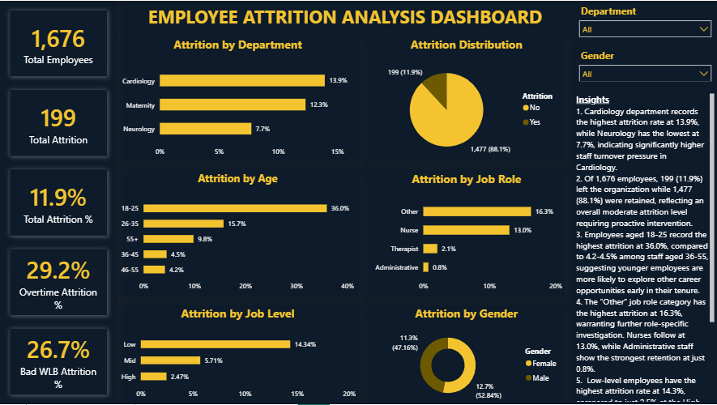
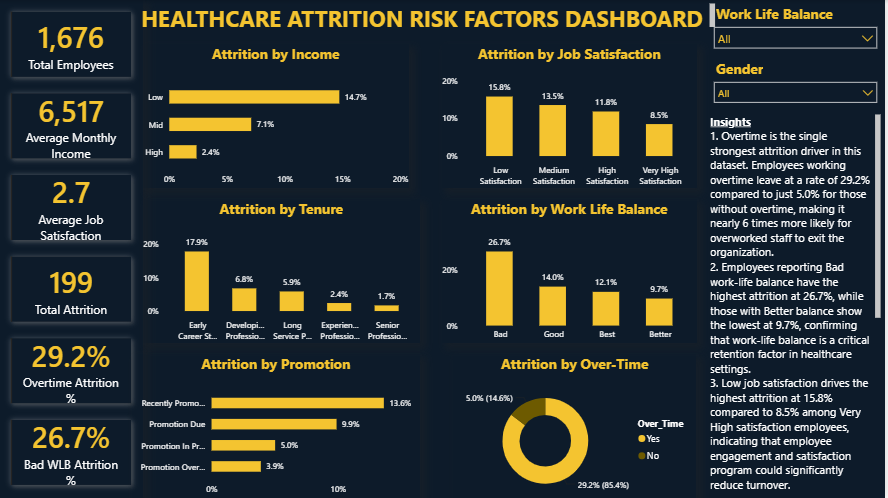

# Project Overview
This project analyzes employee attrition patterns within a healthcare organization covering three departments Cardiology, Maternity, and Neurology and four job roles including Nurses, Therapists, Administrative staff, and Other roles.
Using a dataset of 1,676 employees, the analysis identifies key attrition drivers, workforce demographics, and retention risk factors to help healthcare management make data-driven decisions that reduce turnover and improve staff retention.
The project covers the full data analytics pipeline from data cleaning in Excel, structured querying in MySQL, to an interactive two-page Power BI dashboard.

# Problem Statement
Employee attrition in healthcare settings poses significant challenges to patient care quality, operational efficiency, and organizational costs. High staff turnover disrupts care continuity, increases recruitment and training expenses, and places additional pressure on retained employees.
This project seeks to understand the scale and patterns of employee attrition within a healthcare organization by examining workforce demographics, departmental trends, job satisfaction levels, compensation, overtime demands, and career progression factors.
The goal is to provide actionable insights that enable HR teams and healthcare management to identify high-risk employee segments and implement targeted retention strategies.

# Business Questions
What is the overall attrition rate across the organization?
Which department has the highest attrition rate?
How does attrition differ between male and female employees?
Which age group is most likely to leave the organization?
Which job role experiences the highest attrition?
How does job level influence attrition?
What is the relationship between promotion status and attrition?
How does tenure affect the likelihood of an employee leaving?
Does work-life balance impact attrition rates?
How does job satisfaction influence attrition?
Do employees who work overtime leave more frequently?
How does monthly income level affect attrition?
Which combination of factors presents the highest attrition risk?

# Tools Used
1. Microsoft Excel   : Data cleaning, feature engineering, exploratory review
2. MySQL             : Structured data analysis and querying
3. Power BI          : Interactive dashboard development and visualization
4. DAX               : Custom KPI measures and calculated metrics
5. GitHub            : Project documentation and portfolio publishing

# Dataset Information 
1. Source            : IBM Watson Healthcare Modified Dataset
2. Total Records     : 1,676 employees
3. Departments       : Cardiology, Maternity, Neurology
4. Job Roles         : Administrative, Nurse, Therapist, Other
5. Total Columns     : 39 (after cleaning and feature engineering)

# Data Preparation
Data cleaning and feature engineering were performed in Microsoft Excel before importing into MySQL.
## Steps taken:
1. Removed junk columns with constant values: Over_18, Employee_Count, Standard_Hours
2. Standardized job role values: merged Admin → Administrative using Find & Replace
3. Added Education_Level label column mapping numeric values (1–5) to: Below College, College, Bachelor, Master, Doctor
4. Added Attrition_Flag binary column: Yes = 1, No = 0
5. Added Age_Band grouping : 18–25, 26–35, 36–45, 46–55, 55+
6. Added Monthly_Income_Band : Low, Mid, High
7. Added Work_Life_Balance_Label : Bad, Good, Better, Best
8. Added Promotion_Status based on years since last promotion:
- ≤ 2 years → Recently Promoted
- ≤ 5 years → Promotion In Progress
- ≤ 10 years → Promotion Due
- > 10 years → Promotion Overdue
9. Added Tenure_Band based on total years at company:
- 0–2 years → Early Career Staffs
- 3–5 years → Developing Professionals
- 6–10 years → Experienced Professionals
- 11–20 years → Senior Professionals
- 20+ years → Long Service Professionals
10. Exported cleaned dataset as CSV and imported into MySQL database healthcare_attrition

  # SQL Analysis
  All analysis was performed in MySQL using the healthcare_attrition database

-- Create Database
CREATE DATABASE healthcare_attrition;
USE healthcare_attrition;

-- Create Table
CREATE TABLE employee_attrition (
    Employee_ID INT,
    Age INT,
    Age_Band VARCHAR(10),
    Attrition VARCHAR(5),
    Attrition_Flag INT,
    Business_Travel VARCHAR(30),
    Daily_Rate INT,
    Department VARCHAR(20),
    Distance_From_Home INT,
    Education INT,
    Education_Level VARCHAR(20),
    Education_Field VARCHAR(30),
    Environment_Satisfaction INT,
    Gender VARCHAR(10),
    Hourly_Rate INT,
    Job_Involvement INT,
    Job_Level VARCHAR(10),
    Job_Role VARCHAR(20),
    Job_Satisfaction INT,
    Marital_Status VARCHAR(15),
    Monthly_Income INT,
    Monthly_Income_Band VARCHAR(15),
    Monthly_Rate INT,
    Num_Companies_Worked INT,
    Over_Time VARCHAR(5),
    Percent_Salary_Hike INT,
    Performance_Rating INT,
    Relationship_Satisfaction INT,
    Shift INT,
    Total_Working_Years INT,
    Training_Times_Last_Year INT,
    Work_Life_Balance INT,
    Work_Life_Balance_Label VARCHAR(10),
    Years_At_Company INT,
    Tenure_Band VARCHAR(30),
    Years_In_Current_Role INT,
    Years_Since_Last_Promotion INT,
    Promotion_Status VARCHAR(25),
    Years_With_Current_Manager INT
);

-- Total Employees
SELECT COUNT(*) AS Total_Employee
FROM employee_attrition;

--  Overall Attrition Rate
SELECT 
    COUNT(*) AS Total_Employees,
    SUM(Attrition_Flag) AS Total_Attrition,
    ROUND(SUM(Attrition_Flag) * 100 / COUNT(*), 1) AS Attrition_Rate
FROM employee_attrition;

-- Gender Distribution
SELECT 
    Gender,
    COUNT(*) AS Total_Employees,
    SUM(Attrition_Flag) AS Total_Attrition,
    ROUND(SUM(Attrition_Flag) * 100 / COUNT(*), 1) AS Attrition_Rate
FROM employee_attrition
GROUP BY Gender
ORDER BY Attrition_Rate DESC;

-- Attrition by Department
SELECT 
    Department,
    COUNT(*) AS Total_Employees,
    SUM(Attrition_Flag) AS Total_Attrition,
    ROUND(SUM(Attrition_Flag) * 100 / COUNT(*), 1) AS Attrition_Rate
FROM employee_attrition
GROUP BY Department
ORDER BY Attrition_Rate DESC;

-- Attrition by Job Role
SELECT 
    Job_Role,
    COUNT(*) AS Total_Employees,
    SUM(Attrition_Flag) AS Total_Attrition,
    ROUND(SUM(Attrition_Flag) * 100 / COUNT(*), 1) AS Attrition_Rate
FROM employee_attrition
GROUP BY Job_Role
ORDER BY Attrition_Rate DESC;

-- Attrition by Job Level
SELECT 
    Job_Level,
    COUNT(*) AS Total_Employees,
    SUM(Attrition_Flag) AS Total_Attrition,
    ROUND(SUM(Attrition_Flag) * 100 / COUNT(*), 1) AS Attrition_Rate
FROM employee_attrition
GROUP BY Job_Level
ORDER BY Attrition_Rate DESC;

-- Attrition by Promotion Status
SELECT 
    Promotion_Status,
    COUNT(*) AS Total_Employees,
    SUM(Attrition_Flag) AS Total_Attrition,
    ROUND(SUM(Attrition_Flag) * 100.0 / COUNT(*), 1) AS Attrition_Rate
FROM employee_attrition
GROUP BY Promotion_Status
ORDER BY Attrition_Rate DESC;

-- Attrition by Tenure Band
SELECT 
    Tenure_Band,
    COUNT(*) AS Total_Employees,
    SUM(Attrition_Flag) AS Total_Attrition,
    ROUND(SUM(Attrition_Flag) * 100.0 / COUNT(*), 1) AS Attrition_Rate
FROM employee_attrition
GROUP BY Tenure_Band
ORDER BY Attrition_Rate DESC;

-- Work Life Balance
SELECT 
    Work_Life_Balance_Label,
    COUNT(*) AS Total_Employees,
    SUM(Attrition_Flag) AS Total_Attrition,
    ROUND(SUM(Attrition_Flag) * 100 / COUNT(*), 1) AS Attrition_Rate
FROM employee_attrition
GROUP BY Work_Life_Balance_Label
ORDER BY Attrition_Rate DESC;

-- Job Satisfaction
SELECT 
    CASE 
        WHEN Job_Satisfaction = 1 THEN 'Low'
        WHEN Job_Satisfaction = 2 THEN 'Medium'
        WHEN Job_Satisfaction = 3 THEN 'High'
        ELSE 'Very High'
    END AS Job_Satisfaction_Label,
    COUNT(*) AS Total_Employees,
    SUM(Attrition_Flag) AS Total_Attrition,
    ROUND(SUM(Attrition_Flag) * 100 / COUNT(*), 1) AS Attrition_Rate
FROM employee_attrition
GROUP BY Job_Satisfaction_Label
ORDER BY Attrition_Rate DESC;

-- Monthly Income
SELECT 
    Monthly_Income_Band,
    COUNT(*) AS Total_Employees,
    SUM(Attrition_Flag) AS Total_Attrition,
    ROUND(SUM(Attrition_Flag) * 100 / COUNT(*), 1) AS Attrition_Rate
FROM employee_attrition
GROUP BY Monthly_Income_Band
ORDER BY Attrition_Rate DESC; 

-- Overtime
SELECT 
    Over_Time,
    COUNT(*) AS Total_Employees,
    SUM(Attrition_Flag) AS Total_Attrition,
    ROUND(SUM(Attrition_Flag) * 100 / COUNT(*), 1) AS Attrition_Rate
FROM employee_attrition
GROUP BY Over_Time
ORDER BY Attrition_Rate DESC;

# Key Findings
1. Overall
- Total employees: 1,676 | Employees who left: 199 (11.9%)
2. Department
- Cardiology has the highest attrition at 13.9%
- Neurology has the lowest at 7.7%
3. Demographics
- Employees aged 18–25 have the highest attrition at 36.0%
- Female employees leave at a slightly higher rate (12.7%) than males (11.3%)
4. Job Role & Level
- Other job role has the highest attrition at 16.3%; Administrative the lowest at 0.8%
- Low-level employees leave at 14.3% vs 2.5% for High-level employees

# Risk Factors
## Risk Factor	                   :   Attrition Rate
5. Overtime (Yes)	                 :    29.2%
6. Bad Work-Life Balance	         :    26.7%
7. Early Stage in Role (0–2 yrs)	 :    19.3%
8. Early Career Tenure (0–2 yrs)   :    17.9%
9. Low Job Satisfaction	           :    15.8%
10. Low Income Band	               :    14.7%
11. Cardiology Department	         :    13.9%
12. Recently Promoted	             :    13.6%
13. Nurse Role	                   :    13.0%

# Dashboard Preview
### Page 1 — Employee Attrition Analysis Dashboard

### Page 2 — Healthcare Attrition Risk Factors Dashboard

# DAX Measures
1. Total Employees = COUNTROWS('healthcare_attrition employee_attrition')

2. Total Attrition = SUM('healthcare_attrition employee_attrition'[Attrition_Flag])

3. Total Attrition % = DIVIDE([Total Attrition], [Total Employees])

4. Overtime Attrition % = CALCULATE('healthcare_attrition employee_attrition'[Total Attrition %],'healthcare_attrition employee_attrition'[Over_Time]="Yes")

5. Bad WLB Attrition % = CALCULATE('healthcare_attrition employee_attrition'[Total Attrition %],'healthcare_attrition employee_attrition'[Work_Life_Balance_Label]="Bad")

# Recommendations
1. Address Overtime Urgently — With a 29.2% attrition rate among overtime workers (nearly 6x the non-overtime rate), management must review staffing levels, redistribute workload, and enforce reasonable working hours especially in Cardiology and Maternity departments.

2. Improve Work-Life Balance Programmes — Employees reporting bad work-life balance leave at 26.7%. Flexible scheduling, mental health support, and workload management initiatives should be prioritized.

3. Strengthen Early Career Retention — Staff in their first 2 years account for the majority of attrition (17.9% tenure rate, 19.3% role rate). Structured onboarding, mentorship programmes, and 90-day check-ins can significantly reduce early exits.
4. Review Compensation for Low-Income Employees — Low-income staff leave at 14.7% vs 2.4% for high-income employees — a 6x gap. A compensation review targeting entry-level and low-band roles is critical for retention.=

5. Investigate the "Other" Job Role Category — At 16.3% attrition, this category requires role-specific breakdown to identify which positions are driving turnover and what targeted interventions are needed.

6. Focus Retention Efforts on Cardiology — With the highest departmental attrition at 13.9%, Cardiology needs department-specific retention strategies including workload review, staff engagement surveys, and career development pathways.

7. Support Newly Promoted Employees — Recently promoted staff show a surprisingly high attrition rate of 13.6%, suggesting they may face increased pressure without adequate support. Transition support and leadership coaching for new promotees is recommended.

# Author
Adesoji Justina Ayomide
Radiography Student | Healthcare Data Analyst
Federal University Oye-Ekiti, Nigeria
🔗 LinkedIn
🐙 GitHub
📧 ayomidejustina3@gmail.com
